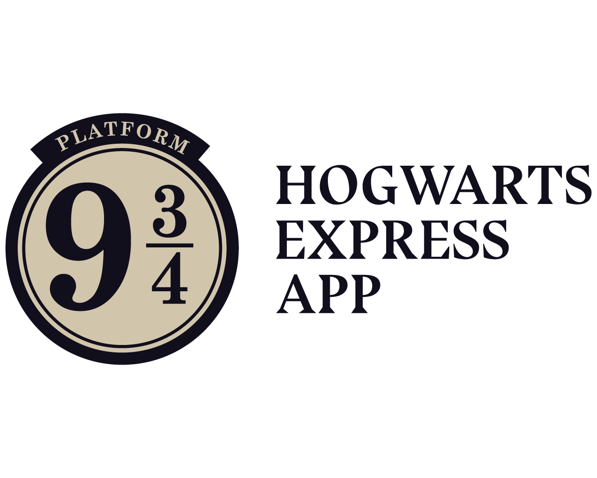
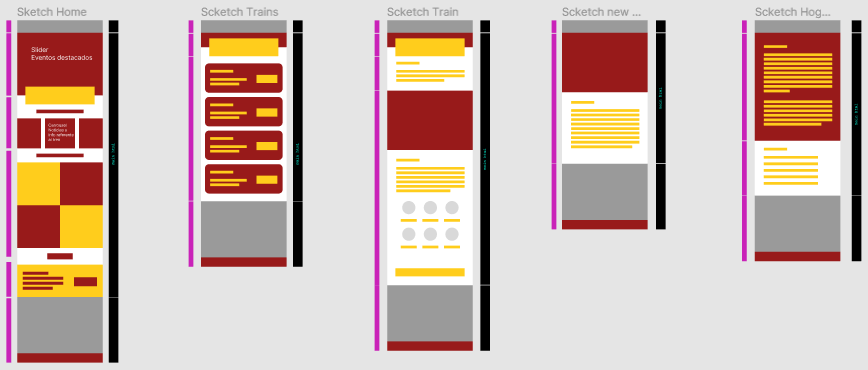
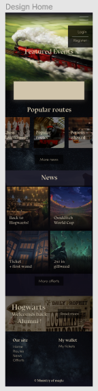
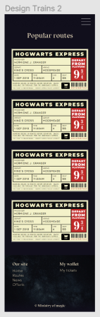
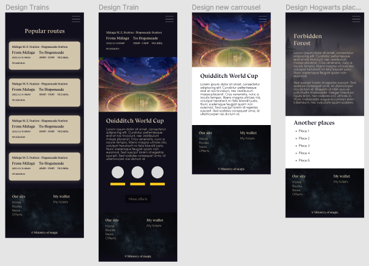

## Project name <h1 align="center">Hogwarts Express App 🎟️🚂</h1>

 
  

## Description
Design and develop a web application to manage ***Hogwarts Express*** routes online.

- About the App:
    
Users can watch the train routes' description, inscribe and unsubscribe themself. The Admin manage the app (CRUD).

On this project we use PHP Laravel to Create the CRUD, the User Management, Database Relationships and CRUD's Testing (TDD: Test-Driven Development).

## Participants
- [Veronika Komarova](https://github.com/VeronikaKoma) - SCRUM Master
- [EstherAma](https://github.com/EstherAma) - Product Owner
- [Ana Rueda Guiu](https://github.com/anaruedaguiu) - Developer
- [Alesia Baldeon Machuca](https://github.com/AlesiaCoder) - Developer
- [Paloma Babot](https://github.com/Uxoa) - Developer

## Screenshots
<h3 align="center">Sketch</h3>

 

 
<h3 align="center">Figma</h3>

  

    
    
    
  

## Stacks 

* Frontend: HTML5, CSS3, SCSS, SASS.
* Backend: PHP Laravel, SQL, phpMyAdmin.
* Bootstrap 5

    Other tools:
    
- Project sketch and final design: Figma
- Visual Studio Code
- Trello
- DrawSQL
- Padlet
- Planning Poker
- Zoom

## Required 
* PHP 7.4 min
* Composer installed

## How to install the project 🪄: 
* Clone git https://github.com/anaruedaguiu/hogwartsExpressApp.git
* Composer install
* Install dependencies in a Visual Studio Code terminal:
  - Run ***npm install*** or ***npm update*** command
  - Run ***npm run dev*** command
* Run the server in a Visual Studio Code new terminal using:
  - ***php artisan serve*** command
* Create a local database on phpMyAdmin with - user : root, password : ""
* Database name: hogwartsexpress
* Run migration:
  - ***php artisan migration:fresh --seed*** command
  
⚠️ **IMPORTANT** ⚠️

The project is currently on the "dev" branch. After successfully installing the project, run ***git switch dev*** to view it.

## Tests
Uncomment the following code lines on **phpunit.xml** is needed before run the test:

      <server name="DB_CONNECTION" value="sqlite"/>
      <server name="DB_DATABASE" value=":memory:"/>

* php artisan test
* vendor/bin/phpunit OK (5 tests, 14 assertions)

## Methodology 
- AGILE with SCRUM
- Mob Programming
- Pair Programming

## Core skills
* MVC Design pattern.
* Git version control system.
* User stories and tasks implementation (Trello).
* Communication and self-evaluation.

## Next steps 
- Add a routes booked list for the user. 
- Restrict the inscribe function to one per user.
- Prevent a user from inscribed/booked in a route if there is no seats available.
- Show as unavailable a past event. 
- The user will receive a confirmation email after doing a reserve (the email will contain basic information about the booked route, such as date, time, origin, destination... and a confirmation about the book). 
- Improve the app adding views and link them on the different footer sections (news, offers...).
- Make changes on the frontend to improve the application logic based on the user experiences.
